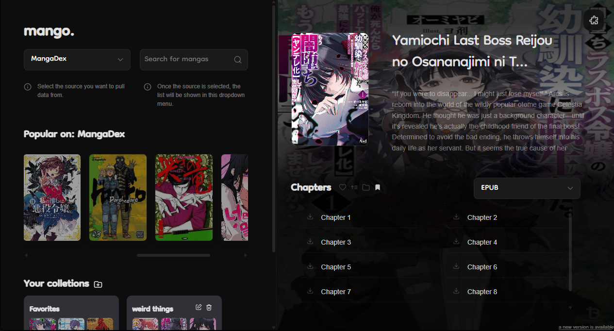

# 🥭 Mango
### A Stremio-like app for Manga

> Read, organize and download manga from multiple sources 

---

## ✨ Preview

---

## 🚀 Features

- 📚 Aggregate manga from multiple sources (via extensions)
- 📥 Download chapters in multiple formats
- ❤️ Favorites & collections
- 🔄 Automatic chapter updates
- ⚡ Fast and lightweight desktop app
- 🧩 Extension-based system (you control your sources)

---

## 🧠 How it works

Mango **does not host any content**.

Instead, it works like:
- 🧩 You install extensions
- 🌐 Extensions provide sources
- 📖 You browse and read from them

---

## 📦 Download

👉 **[Download latest version](../../releases/latest)**

## 🧩 Extensions

Mango is powered by extensions.

- Add/remove sources anytime
- Community-driven
- Fully modular

> No extensions = no content Mango is a **tool**, not a content provider dont sue me

## 📩 For Website Owners / Someone that want to improve Mango

📧 Contact (my discord): shalashaska21 
