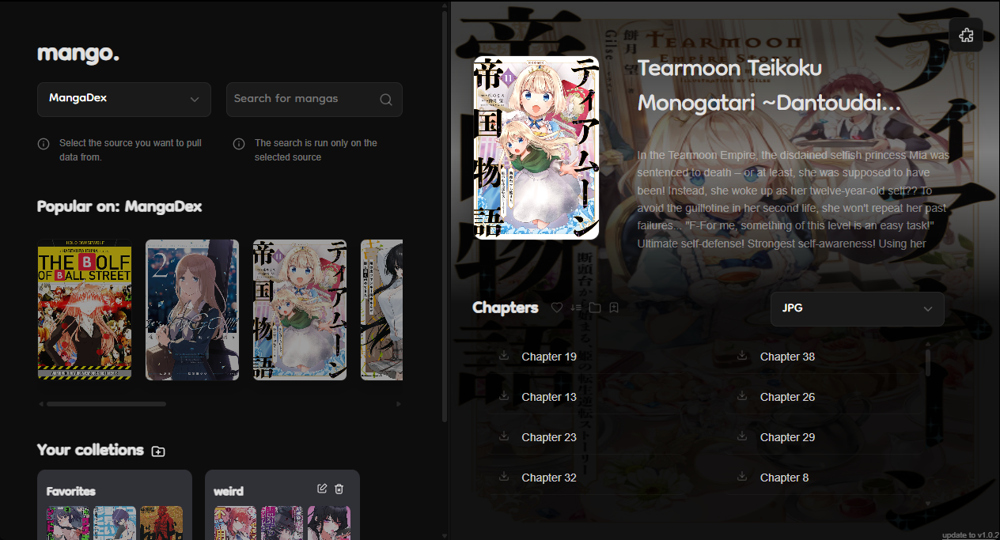

# 🥭 Mango
### A Stremio-like app for Manga

> Read, organize and download manga from multiple sources — all in one place.

---

## Preview

---

## Features

- 📚 Aggregate manga from multiple sources (via extensions)
- 📥 Download chapters in multiple formats
- ❤️ Favorites & collections
- 🔄 Automatic chapter updates
- ⚡ Fast and lightweight desktop app
- 🧩 Extension-based system (you control your sources)

---

##  Download

**[Download latest version](../../releases/latest)**

- Windows (.exe)
- No installation required (portable)

---

##  Getting Started

1. Open Mango
2. Install extensions
3. Start reading

-if you have any problem, make sure that you have webview2 installed

---

##  For linux users:
1. good luck for now

## 🧩 Extensions

Mango is powered by extensions.

- Add/remove sources anytime
- Fully modular

## Dont sue me, i dont have money to pay...

> No extensions = no content

## 📩 For Website Owners / anyone who wants to kill me

📧 Contact: shalashaska21 (my discord)

